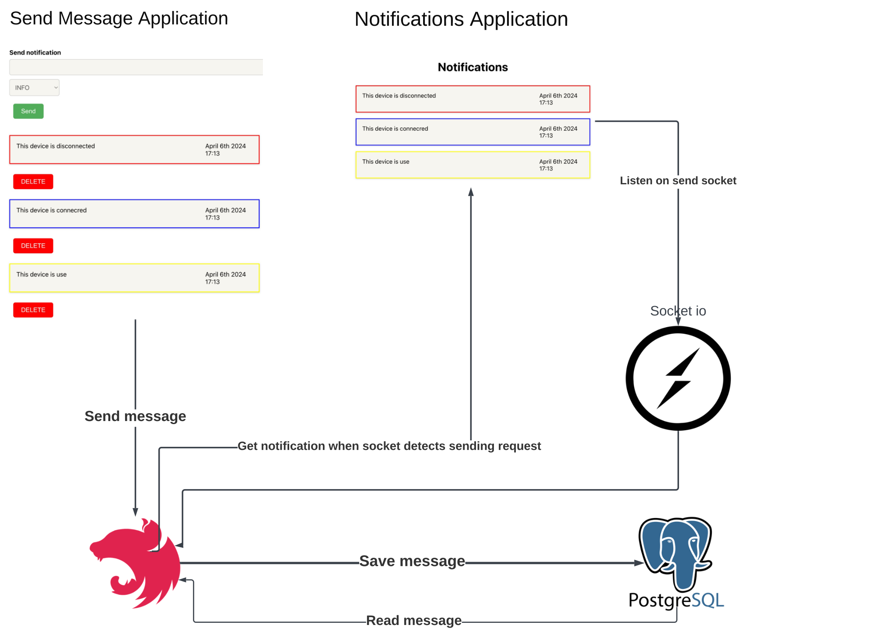

# Notification system



## Run instructions
### Set up database
Database is Postgres SQL, it is running into docker container
Make sure docker demon is started and run postgres container using following command
```
$docker run --name notification -p 5432:5432 -e POSTGRES_PASSWORD=password123 -d postgres
```

### Set up clients and server
Need to install node modules. Run commands three times for each directory
```
$npm install
```

Node Js server environments "server/.env" file
```
POSTGRES_HOST=localhost
POSTGRES_PORT=5432
POSTGRES_USER=postgres
POSTGRES_PASSWORD=password123
POSTGRES_DATABASE=notificationdb
```

### Start applications
Need to start all applications, run this command for each directory
```
$npm start
```

### Application ports
```
notification client - localhost:3006
notification send client - localhost:3001
server - localhost:3000
```
